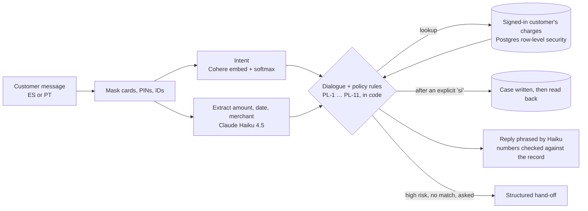

# GT Bank Dispute Desk

An AI customer-service system for **transaction disputes** (charges a customer doesn't recognize, and fees they consider wrong) at **GT Bank**, a fictional Latin American bank. It works in **Spanish and Portuguese**, finds the charge in the signed-in customer's own records, explains it or opens a verified review, and hands hard cases to a specialist with the facts already checked.

**The model chooses the words. Code decides what happens.** Built by **Los Huitecos** for the Factored AI & Data Hackathon 2026 on the organizer's synthetic LATAM Bank dataset.

**Live:** https://latam-bank-service-sigma.vercel.app (sign-in required; test logins are in the submission email)

---

## Why disputes

From the organizer's data (686,296 contacts, 67,095 complaints, Jun 2023 – Jun 2026; [analysis](docs/contact-reason-analysis.md)):

- Complaints are 17% of contacts but **23% of agent hours**, with the worst first-contact resolution (**43.6%**) and the lowest satisfaction (**2.43 / 5**).
- **40% of complaints dispute money**: an unrecognized charge or a wrongful fee. The median complaint takes 15–16 days to resolve.
- Many "unrecognized" charges are pending or already reversed, which can be answered from the record without opening a case.

## What it does

| Case | Example | What happens |
|---|---|---|
| **Resolved** | "No reconozco un cargo de 45 dólares de ayer" | The charge is pending: explained from the record, nothing opened (PL-3) |
| **Clarified** | "O que aconteceu com minha compra de 25 dólares?" | Two charges match: both are listed and the customer picks one (PL-10) |
| **Disputed** | "No reconozco un cargo de 350 dólares del 10 de junio" → "Sí" | The charge is confirmed, a review case is written and read back, then its reference is quoted (PL-7) |
| **Handed off** | "No reconozco un cargo de 120 dólares del 3 de junio" | Fraud score 41.7 ≥ 30: a specialist gets a structured case (request, verified facts, actions, open questions), no transcript (PL-6) |
| **Refused** | "Devuélveme 5000" | No money moves, ever: a review or a person is offered instead |

**Agent console** (`/agent`, [D-007](docs/decisions.md)): every hand-off arrives in a specialist's inbox with the case's verified facts and a code-built briefing (no transcript). The specialist accepts it and chats with the customer live, in the customer's own chat window; the customer's messages are masked before they are stored, and a customer can only ever reach their own case.

## Results (offline)

On the deployed app with the production model, 56 scenarios × 3 runs = 168 graded conversations ([report](reports/eval_production-cohere.md)), compared with today's human-only service on the same cases:

| Metric | System | Human-only baseline |
|---|---|---|
| Safe automated resolution (in-scope cases) | **100%** (72/72) | 0% |
| Containment (ended without a person) | 78.6% (132/168) | 0% |
| Missed hand-offs | **0 of 36** | 0 |
| Unnecessary hand-offs | **0 of 129** | 129 of 129 |
| Wrong actions / leaks | **0 / 0 of 168** | 0 |
| Latency per reply, p50 / p95 | 3.0 s / 4.2 s | n/a |
| Cost per resolution | $0.0082 | n/a |

Missed and unnecessary hand-offs are counted over different subsets of the 168 (the cases that needed a person, and the cases that did not), so the two denominators don't add up to 168; the definitions are in the [report](reports/eval_production-cohere.md). The break-it suite had 6 of 72 misses (PI-4 and ML-3, 3 runs each); none was a wrong action or a leak: the assistant asked a clarifying question or refused where the suite expected something else, and nothing was opened or revealed ([docs/evaluation-findings.md](docs/evaluation-findings.md), EF-6).

The learned component (intent classifier) against keyword rules:

| | Intent model | Keyword rules |
|---|---|---|
| Accuracy, sealed test set (84 clear phrases) | **91.7%** | 82.1% |
| Accuracy, human-written messages (24 clear of 31) | **83.3%** | 50.0% |
| Wrong actions, human-written | **0%** | 50% |

Sources: [reports/intent_eval_cohere-mv3.md](reports/intent_eval_cohere-mv3.md), [reports/intent_eval_human.md](reports/intent_eval_human.md). Every number is offline, on team-written, LLM-drafted or synthetic messages unless marked human-written. Small samples: read the confidence intervals in the reports.

### Impact (projection)

Money disputes take about 1,900 agent-hours a year in this bank's contact centre (9.3% of all agent time). If they come through chat, the system would take **816–1,495 of those hours** off agents each year, for about **$70–130 a year** in model cost. Today 85% of complaints arrive by phone, so the immediate saving is about a tenth of that; the dataset has no wage data, so dollars are left to an hourly-cost assumption. How it's built and why it could be wrong: [docs/impact.md](docs/impact.md) · numbers: [reports/impact_estimate.md](reports/impact_estimate.md).

## How it works



- **Understand:** sensitive data is masked before any model sees it. The intent model abstains below 0.70 confidence, a threshold chosen on validation by cost (wrong action 5, acting on an ambiguous message 2, needless question 1).
- **Decide:** dialogue and policy are plain code with unit tests ([docs/conversation.md](docs/conversation.md), [docs/policy.md](docs/policy.md)). The fraud cutoff (score ≥ 30) was chosen on 2023–25 data and checked on held-out 2026 ([report](reports/fraud_threshold.md)).
- **Act and verify:** the lookup only ever sees the signed-in customer's rows. A case is written and read back before the reply quotes its reference ([docs/verification.md](docs/verification.md)).
- **Escalate:** hand-offs carry verified facts, actions taken and open questions, and never promise timing ([docs/handoff.md](docs/handoff.md)). A specialist picks them up in the agent console ([docs/contracts.md](docs/contracts.md) K6).
- **Fall back safely:** if Bedrock fails, a local multilingual-e5-small model inside the function classifies; if Haiku fails, ES/PT templates answer. One JSON trace line per turn records the models, prompt versions, rule and latency.

## Data pipeline

Organizer CSVs (13 tables) → **bronze** in BigQuery (every column typed, 23.5M rows, 0 cast failures) → **silver** (cleaned; bronze = silver + quarantine, reconciled on all 13 tables) → **gold** (dbt models with contracts and tests) → a **serving slice** in Supabase (2,040 customers, 23,052 charges, chosen so every policy path has real data; each load recorded in `data_version`). Log: [docs/data-pipeline.md](docs/data-pipeline.md) · data issues found: [docs/data-issues.md](docs/data-issues.md) · dbt project: [pipeline/dbt](pipeline/dbt/README.md).

The organizer's text fields are templated and contain no Portuguese, so the language model was trained on **948 team-written ES/PT phrases** with a sealed test set (SHA-256 manifest; every test run logged in `reports/test_runs.jsonl`). Banking77 was tried as extra training data and rejected on measurement ([docs/intent-model.md](docs/intent-model.md) D17).

## Limits

- No Portuguese in the organizer data: Portuguese coverage is team-written and labeled as such.
- The human-written check is small: 31 messages from one author.
- All results are offline; there is no production traffic.
- The break-it suite is not clean: 6 of 72 cases missed (safe, none a wrong action or leak; see Results).
- The serving slice holds 2,040 customers and 12 months of charges.
- What the evaluation found and how each finding was resolved: [docs/evaluation-findings.md](docs/evaluation-findings.md).

## Run it

**To try the system, use the live app** (link at the top; test logins are in the submission email). Running it locally needs server-only secrets (Supabase, Bedrock, Anthropic) that are not in the repo. Without them the app still starts, but it silently uses a stand-in lookup with data for only two logins (`demo.mx` and `otro.mx`), a local fallback model instead of Cohere, and an in-memory agent console with seeded requests. That is enough to read the code and run the tests, but not to reproduce the reported results.

```bash
npm install
cp .env.example .env.local       # fill in the server-only secrets (optional, see above)
npm run dev                      # http://localhost:3000
npm test                         # unit tests: dialogue, policy, masking, lookup, evaluation harness
```

Evaluation against a running app ([docs/evaluation.md](docs/evaluation.md)):

```bash
npm run eval -- --suite tc|step17|break --repeat 3
npm run eval:report -- --name <name>          # writes reports/eval_<name>.md
uv run python pipeline/score_human.py         # intent model vs. keyword rules on human-written messages
uv run python analysis/impact_estimate.py     # projected agent time and cost -> reports/impact_estimate.md
```

Data and model (Python via [`uv`](https://docs.astral.sh/uv/); run `uv sync` once first to create the environment):

```bash
uv sync
./scripts/download_data.sh                                   # organizer data -> data/raw (git-ignored)
uv run python pipeline/bronze.py                             # local DuckDB bronze
(cd pipeline/dbt && uv run dbt build --profiles-dir . --target bq)   # silver + gold in BigQuery
uv run python pipeline/load_supabase.py                      # gold serving slice -> Supabase
(cd pipeline && uv run python train_intent.py --embedding cohere-mv3)  # validation only; --test is logged
```

## Repository

```
src/app, src/components   Next.js app: sign-in, chat, agent console (/agent), API routes
src/lib                   intent, conversation, policy, lookup, cases, agent, privacy, reply
supabase/                 migrations (schema, row-level security) and the RLS check
pipeline/                 data prep, dbt project, model training and evaluation scripts
data/phrases/             team-written ES/PT phrase set, labeling guide, sealed split manifest
evals/                    conversation harness, test suites, break-it attacks, report generator
reports/                  generated reports (never hand-edited)
docs/                     decisions and design notes (start at docs/README.md)
```

## Team: Los Huitecos

Miguel ([@miguelsuapin1](https://github.com/miguelsuapin1)) · Luis Pedro ([@lpcuellar](https://github.com/lpcuellar)) · Carlos ([@Carloscuellark](https://github.com/Carloscuellark))

GT Bank is a fictional bank. The data is the organizer's synthetic LATAM Bank v1.0.0; team-generated and synthetic inputs are labeled as such.
